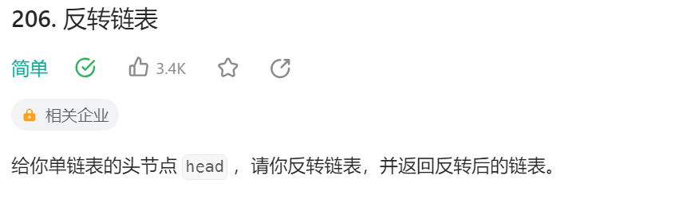
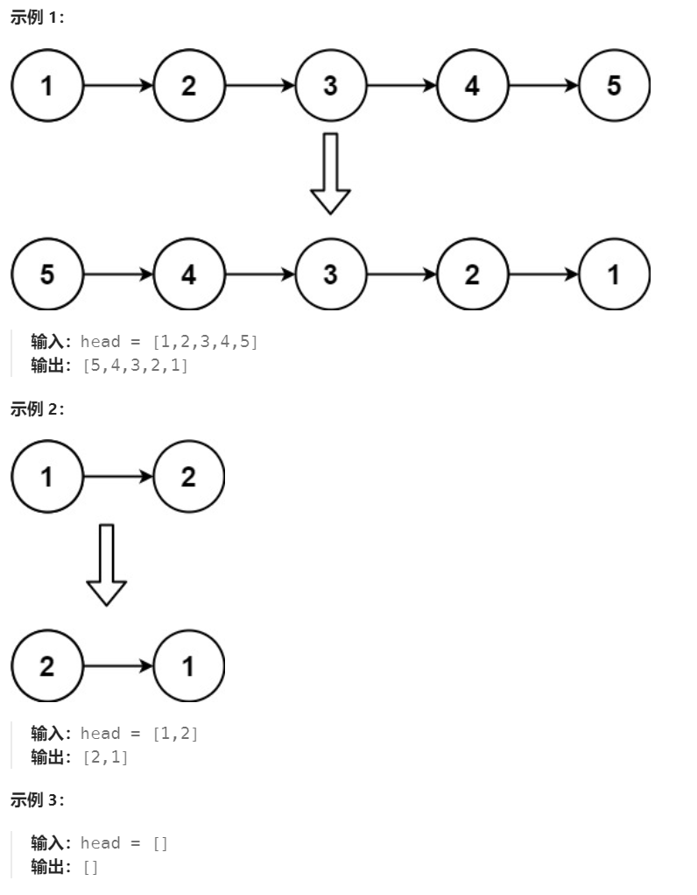
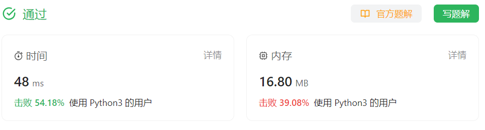

# 206 反转链表

## 一、题目



## 二、示例



## 三、思路

单链表逆序排列，可以使用前后两个指针的方法，从头遍历链表调整每个节点的next指向反转。

也可以使用递归的方法，使每次反转的链表大小递减。

## 四、代码

> 双指针遍历

```python
# Definition for singly-linked list.
# class ListNode:
#     def __init__(self, val=0, next=None):
#         self.val = val
#         self.next = next
class Solution:
    def reverseList(self, head: Optional[ListNode]) -> Optional[ListNode]:
        prev,curr = None, head
        while curr:
            nxt = curr.next
            curr.next = prev
            prev = curr
            curr = nxt
        return prev
```


> 递归

```python
# Definition for singly-linked list.
# class ListNode:
#     def __init__(self, val=0, next=None):
#         self.val = val
#         self.next = next
class Solution:
    def reverseList(self, head: Optional[ListNode]) -> Optional[ListNode]:
        # 结束条件
        if not head:
            return None
        
        # 当递归到最后一个节点，即为反转链表的第一个节点
        newhead = head
        if head.next:
            # 递归在非最后节点，从下层返回中拿到新头并向上层返回
            newhead = self.reverseList(head.next)
            # 反转当前层前后两节点
            head.next.next = head
            head.next = None
        
        return newhead
```


## 五、提交

> 双指针遍历



> 递归

