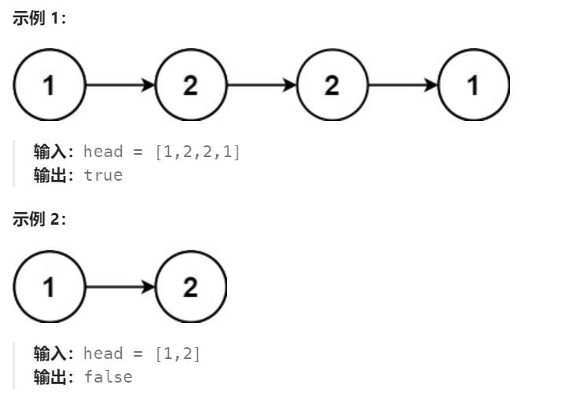

# 234 回文链表

## 一、题目


## 二、示例




## 三、思路

观察可知，回文数可以分总数为奇数、偶数两种，比如：

> 1,2,2,1
>
> 1,2,3,2,1

我们可以考虑从中间将回文数分成两部分，比较前一部分顺序与后一部分逆序是否相同即可。

1、划分两部分

由于要从中间划分，可以使用快慢指针的方法。当快指针到达末尾时，慢指针总会落在前一部分的最后一个节点上。

2、将后一部分元素逆序排列

3、同时遍历两部分元素比较是否相同


## 四、代码

```python
# Definition for singly-linked list.
# class ListNode:
#     def __init__(self, val=0, next=None):
#         self.val = val
#         self.next = next
class Solution:
    def isPalindrome(self, head: Optional[ListNode]) -> bool:
        slow,fast = head,head.next
        while fast and fast.next:
            fast = fast.next.next
            slow = slow.next
        h2 = slow.next # 后一部分的首节点

        # 逆序后一部分
        prev,curr = None,h2
        while curr:
            nxt = curr.next
            curr.next = prev
            prev = curr
            curr = nxt
        h2 = prev # 逆序后的首节点

        # 比较两部分数（后一部分数相对少）
        while h2:
            if h2.val != head.val:
                return False
            h2 = h2.next
            head = head.next
        return True
```


## 五、提交

