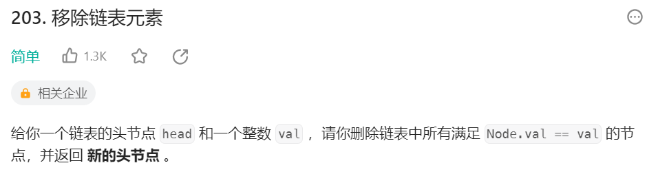
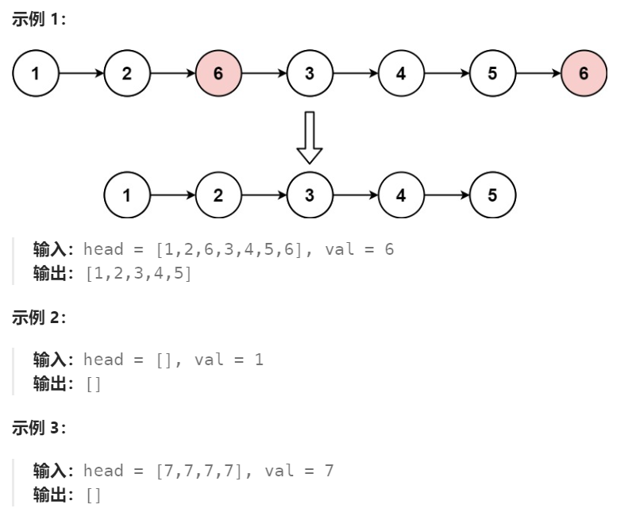
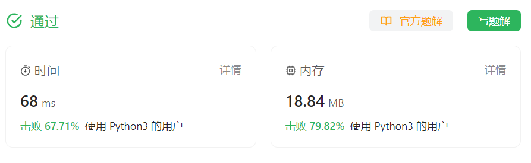

# 203 移除链表元素

## 一、题目




## 二、示例




## 三、思路

使用前、后两个指针从头遍历链表，找到匹配元素删除即可。

考虑到若要删除的是第一个节点，及最后返回新链表首节点的操作，可以在原来链表前添加一个辅助空节点方便操作。


## 四、代码

```python
# Definition for singly-linked list.
# class ListNode:
#     def __init__(self, val=0, next=None):
#         self.val = val
#         self.next = next
class Solution:
    def removeElements(self, head: Optional[ListNode], val: int) -> Optional[ListNode]:
        dummy = ListNode(next = head)
        prev, curr = dummy, head

        while curr:
            nxt = curr.next # 先保留curr下一节点指向。再考虑是否要删除
            if curr.val == val:
                prev.next = nxt # curr要删除，prev不需要移动
            else:
                prev = curr # curr不用删除，prev需向后移动
            curr = nxt

        return dummy.next # 新链表首节点由dummy指向
```


## 五、提交

