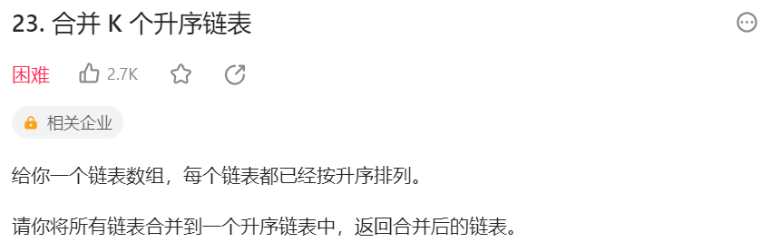
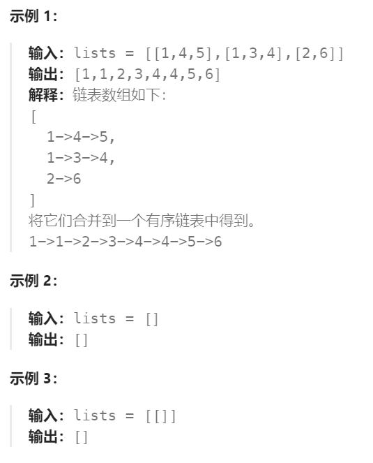
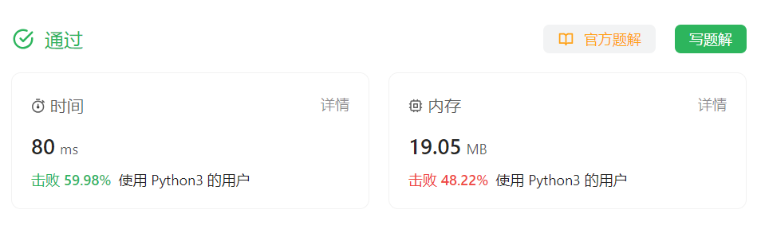

# 23 合并K个升序链表

## 一、题目




## 二、示例




## 三、思路

利用两个链表合并的方法，可以先将K个链表中相近的两个链表进行合并，每次使链表总数减半，最终合并为一个链表。

两两合并一次的时间复杂的为O(N)，K个链表一共合并log(K)次，总时间复杂的为log(K)O(N)


## 四、代码

```python
# Definition for singly-linked list.
# class ListNode:
#     def __init__(self, val=0, next=None):
#         self.val = val
#         self.next = next
class Solution:
    def mergeKLists(self, lists: List[Optional[ListNode]]) -> Optional[ListNode]:
        if not lists or len(lists) == 0:
            return None

        # 总链表数量大于1，继续合并
        while len(lists) > 1:
            # 定义新的总链表池，完成一次两两合并后更新
            mergedLists = []
            # 在当前总链表数组中，每次取两个相邻链表进行合并
            for i in range(0,len(lists),2):
                list1 = lists[i] # 0，2，4，len(list) - 1 必存在
                list2 = lists[i + 1] if (i+1) < len(lists) else None # 可能越界判断
                mergedLists.append(self.mergeTwoLists(list1,list2))
            # 更新当前总链表池，判断是否需要继续两两合并
            lists = mergedLists
        # 最后总链表池中只剩最后合并出的一个大链表
        return lists[0]

    def mergeTwoLists(self,l1,l2):
        dummy = ListNode()
        curr = dummy

        while l1 and l2:
            if l1.val <= l2.val:
                curr.next = l1
                l1 = l1.next
            else:
                curr.next = l2
                l2 = l2.next
            curr = curr.next
        
        if not l1:
            curr.next = l2
        if not l2:
            curr.next = l1
        
        return dummy.next

```

