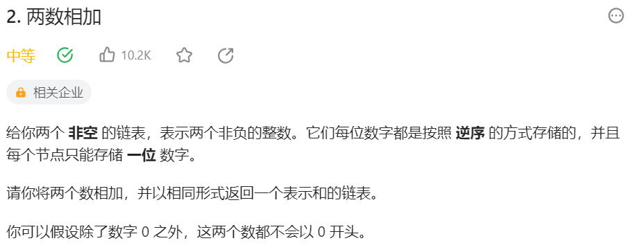
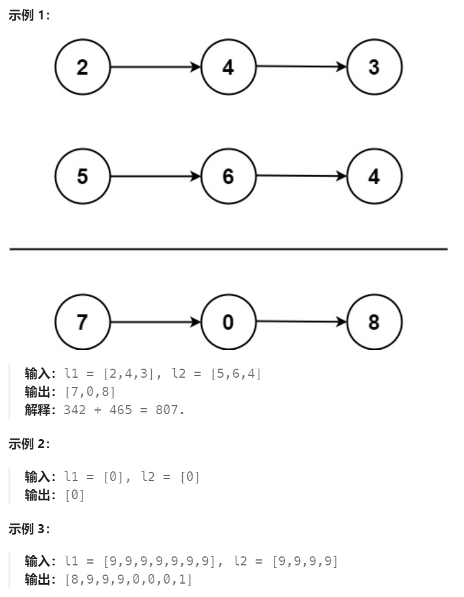
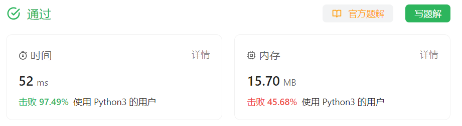

# 2 两数相加

## 一、题目




## 二、示例




## 三、思路

根据竖式加法的方法，两数相加应该从各位开始，每次执行各位数字及进位相加的操作，得到当前位的和及下一位进位值。

题中数字从个位开始逆序排列，从链表头部开始遍历即可。

当其中一个数字遍历完后，空节点作为0处理。

当两个数字都遍历完后，需要检查进位位是否有值。


## 四、代码

```python
# Definition for singly-linked list.
# class ListNode:
#     def __init__(self, val=0, next=None):
#         self.val = val
#         self.next = next
class Solution:
    def addTwoNumbers(self, l1: Optional[ListNode], l2: Optional[ListNode]) -> Optional[ListNode]:
        dummy = ListNode()
        curr = dummy
        carry = 0

        while l1 or l2 or carry:
            # 获取当前位值
            val1 = l1.val if l1 else 0
            val2 = l2.val if l2 else 0

            # 计算当前位和及进位值
            val = val1 + val2 + carry
            carry = val // 10
            val = val % 10
            curr.next = ListNode(val)

            # 更新指针
            curr = curr.next
            l1 = l1.next if l1 else None
            l2 = l2.next if l2 else None

        return dummy.next
```


## 五、提交

