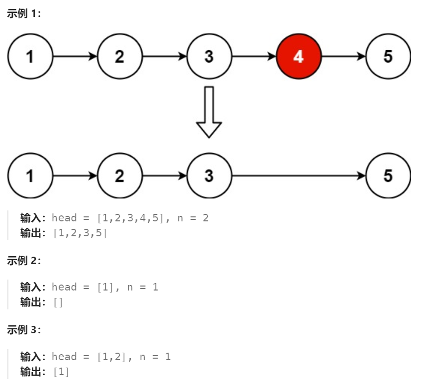

# 19 删除链表的倒数第N个节点

## 一、题目


## 二、示例




## 三、思路

单链表中删除倒数某个节点，需要确定要删除的节点及其前一个节点。

可以先在链表头部设置两个指针，两个指针间跨度为N，向后遍历链表，当后一个指针结束后，前一个指针正好指向倒数第N个节点。


## 四、代码

```python
# Definition for singly-linked list.
# class ListNode:
#     def __init__(self, val=0, next=None):
#         self.val = val
#         self.next = next
class Solution:
    def removeNthFromEnd(self, head: Optional[ListNode], n: int) -> Optional[ListNode]:
        dummy = ListNode(0,head)
        left,right = dummy,head # 初始化双指针
        while n > 0 and right: # 调整双指针之间跨度
            right = right.next
            n -= 1

        # 双指针同时向后遍历
        while right:
            left = left.next
            right = right.next
        
        # 删除倒数第N个节点
        left.next = left.next.next
        
        return dummy.next
```


## 五、提交

