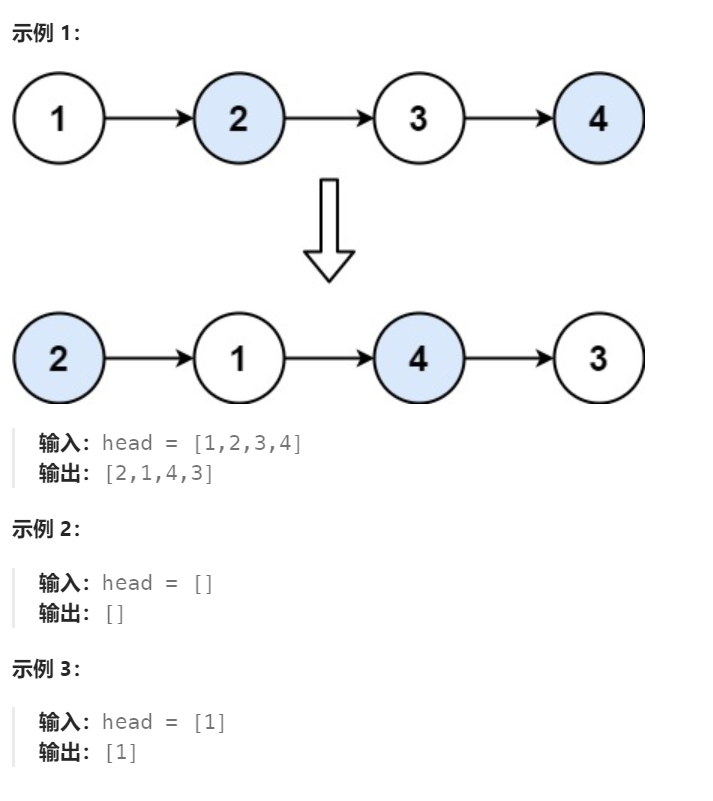

# 24 两两交换链表中的节点

## 一、题目


## 二、示例




## 三、思路

由于链表头部节点会发生变动，可以创建虚拟头节点辅助遍历。

从头开始遍历，prev指向每组第一个节点前一个节点（初始为dummy），curr指向每组第一个节点，tmp指向每组第二个节点，nxt指向要处理的下一组中的第一个节点。

每次循环使tmp节点指向curr节点，curr节点指向nxt节点，再更新prev及curr。


## 四、代码

```python
# Definition for singly-linked list.
# class ListNode:
#     def __init__(self, val=0, next=None):
#         self.val = val
#         self.next = next
class Solution:
    def swapPairs(self, head: Optional[ListNode]) -> Optional[ListNode]:
        dummy = ListNode(0,head)
        pre,curr = dummy,head

        while curr and curr.next:
            nxt = curr.next.next # 下一组两个的第一个
            tmp = curr.next # 当前组的第二个

            # 交换第一组两节点指针
            tmp.next = curr
            curr.next = nxt
            pre.next = tmp

            # 更新遍历指针
            pre = curr
            curr = nxt

        return dummy.next


```


## 五、提交

