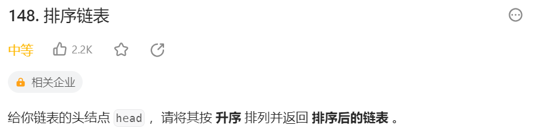
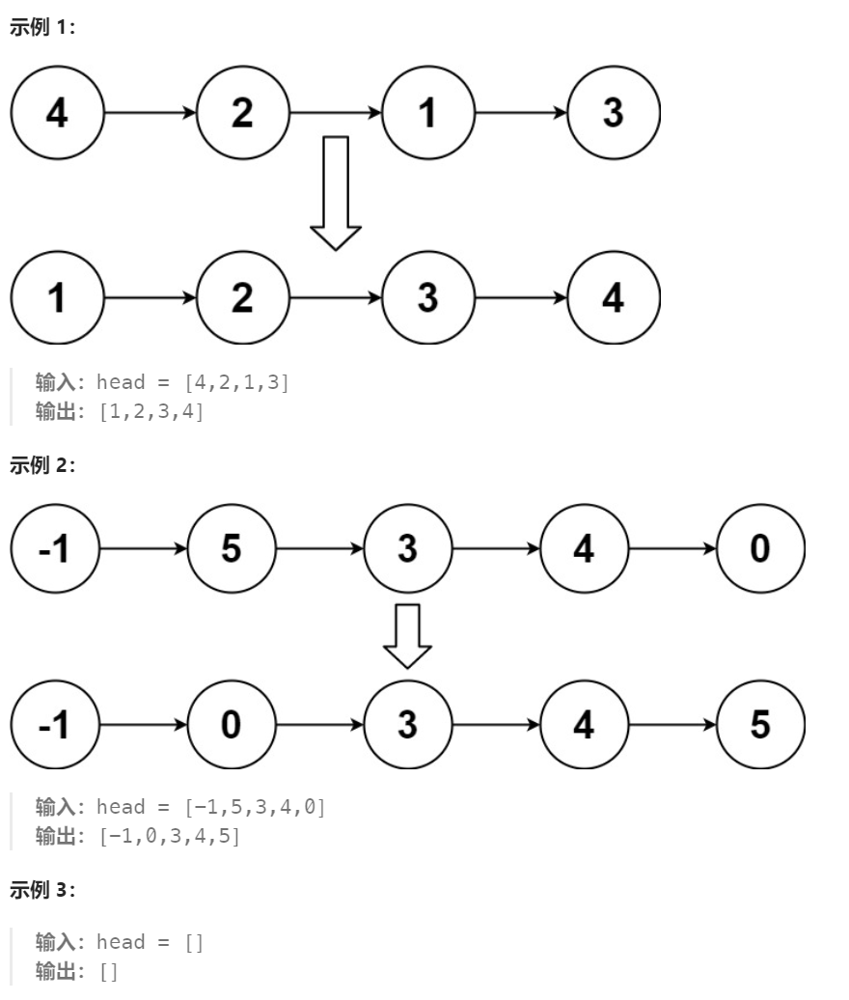
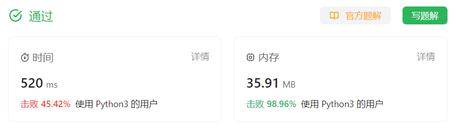

# 148 排序链表

## 一、题目




## 二、示例




## 三、思路

这里采用归并排序的思路，先将N个元素平分log(N)次，每次平分后对左右两个链表进行一次归并排序，时间复杂度O(N)，总体时间复杂度为O(N)*log(N)


## 四、代码

```python
	# Definition for singly-linked list.
# class ListNode:
#     def __init__(self, val=0, next=None):
#         self.val = val
#         self.next = next
class Solution:
    def sortList(self, head: Optional[ListNode]) -> Optional[ListNode]:
        # 递归出口-当链表只有一个节点或已空
        if not head or not head.next:
            return head
        
        # 将当前链表切分为左右两个
        leftHead = head
        leftEnd = self.split(leftHead)
        rightHead = leftEnd.next
        leftEnd.next = None

        # 先对左右两个链表用同样的方式排序
        leftlist = self.sortList(leftHead)
        rightList = self.sortList(rightHead)

        # 对左右两个已经有序的链表进行归并排序
        dummy = ListNode()
        curr = dummy
        l1,l2 = leftlist,rightList

        while l1 and l2:
            if l1.val <= l2.val:
                curr.next = l1
                l1 = l1.next
            else:
                curr.next = l2
                l2 = l2.next
            curr = curr.next

        if not l1:
            curr.next = l2

        if not l2:
            curr.next = l1   

        return dummy.next

    # 使用快慢指针平分链表
    def split(self,head):
        slow,fast = head,head.next
        while fast and fast.next:
            slow = slow.next
            fast = fast.next.next
        return slow
    
```


## 五、提交

