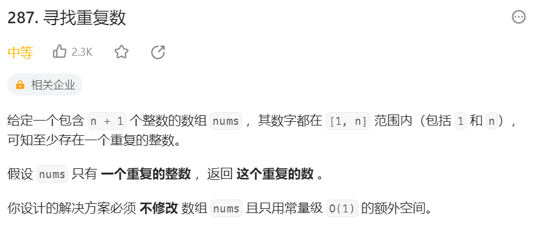
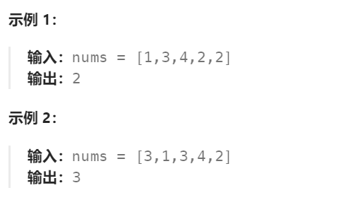
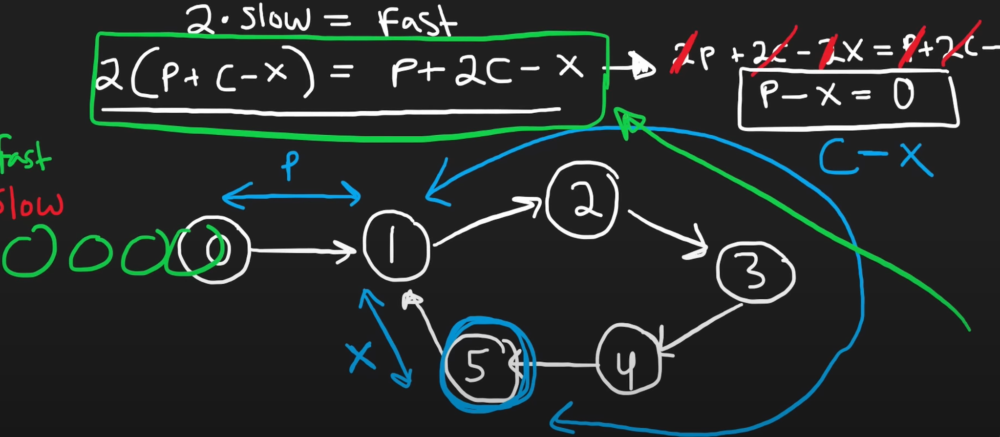

# 287 寻找重复数

## 一、题目




## 二、示例




## 三、思路

题目意思：长度为n的数组中，就是在n个位置上填入n个数，每个数大小在1到n-1之间。由于1到n-1只有n-1个数，所以必然有一个位置上的数是重复的。

1、长度为n的数组中，下标范围在0到n-1，因此数组中每个位置的数正好可以对应一个数组下标，可以视为一个数组存放的链表结构。

若某个下标被两次指向，即可说明该下标元素是链表循环的开始，即重复出现的元素。


2、问题转换为在链表中寻找出现循环的第一个节点，可以使用弗洛伊德算法。

首先使用间隔为1的快慢指针遍历链表，直到快慢指针相遇的节点C。

再次从头节点和C节点同时开始慢遍历，直到两指针相遇，即为出现循环的第一个节点。




## 四、代码

```python
class Solution:
    def findDuplicate(self, nums: List[int]) -> int:
        slow,fast = 0,0

        while True:
            slow = nums[slow] # 慢指针向后走一次
            fast = nums[nums[fast]] # 快指针向后走两次
            if slow == fast: # 找到快慢相遇点
                break

        tmp = 0
        while True:
            tmp = nums[tmp]
            slow = nums[slow]
            if tmp == slow:
                return slow
```


## 五、提交

