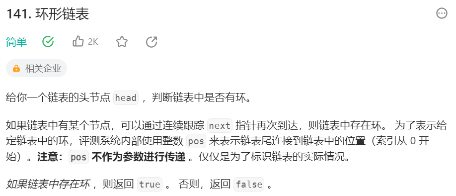
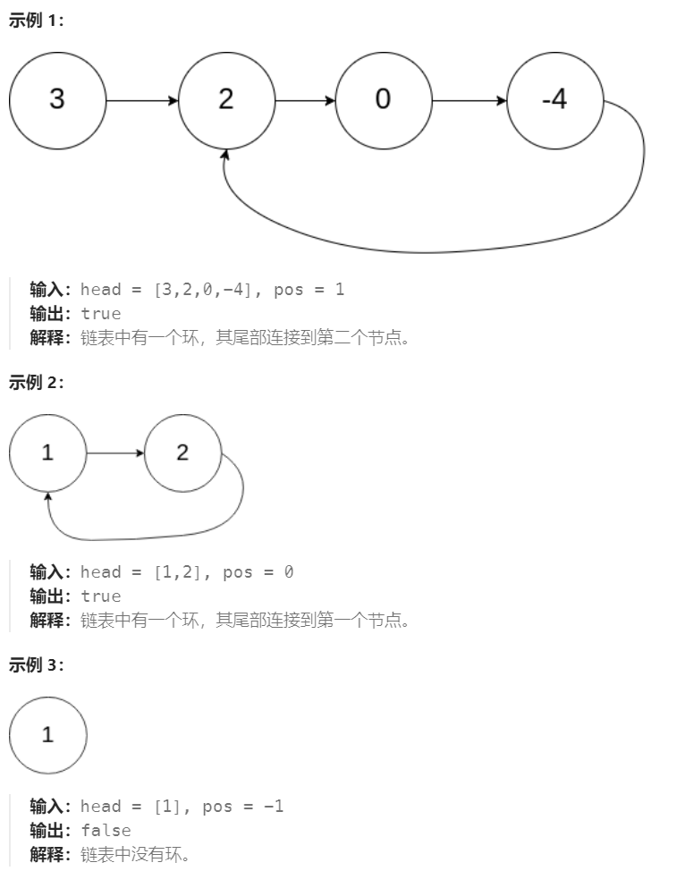

# 141 环形链表

## 一、题目




## 二、示例



## 三、思路

环形链表检测是否存在循环，可以使用快慢指针的方法。若链表存在循环，由于快指针每次比慢指针多移动一位，在同一方向上两者距离会不断缩小直到相遇。

两个指针之间的距离差最大不超过N，因此时间复杂度为O(N)


## 四、代码

```python
# Definition for singly-linked list.
# class ListNode:
#     def __init__(self, x):
#         self.val = x
#         self.next = None

class Solution:
    def hasCycle(self, head: Optional[ListNode]) -> bool:
        slow,fast = head,head

        while fast and fast.next:
            slow = slow.next
            fast = fast.next.next

            if slow == fast:
                return True

        return False
```


## 五、提交

