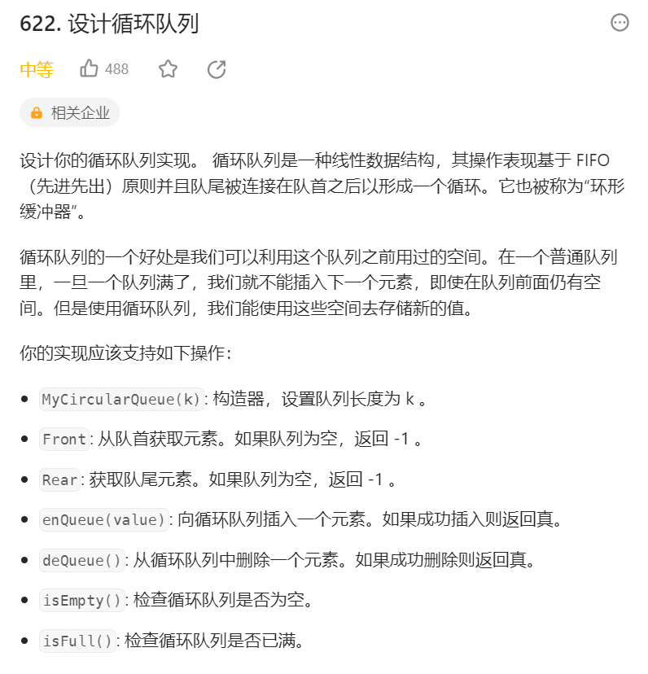
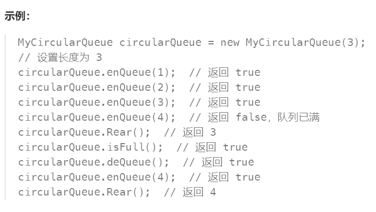

# 622 设计循环队列

## 一、题目




## 二、示例




## 三、思路

使用链表实现队列，普通队列也可满足循环队列的要求，只有队列非空即可加入新的元素。


## 四、代码

```python
# 定义链表节点，使用双向链表便于找到队尾节点
class ListNode():
    def __init__(self,val,prev,next):
        self.val = val
        self.prev = prev
        self.next = next

class MyCircularQueue:

    def __init__(self, k: int):
        self.space = k # 初始化队列容量
        self.front = ListNode(0,None,None) # 队头空节点
        self.rear = ListNode(0,None,None) # 队尾空节点
        # 初始队列为空，队头空节点与队尾空节点相连
        self.front.next = self.rear
        self.rear.prev = self.front

    def enQueue(self, value: int) -> bool:
        if self.isFull(): # 队列已满
            return False
        
        curr = ListNode(value,None,None) 
        # 新入队节点插入队尾
        curr.next = self.rear
        curr.prev = self.rear.prev

        self.rear.prev.next = curr
        self.rear.prev = curr

        self.space -= 1
        return True

    def deQueue(self) -> bool:
        if self.isEmpty(): # 队列已空
            return False

        self.front.next.next.prev = self.front 
        self.front.next = self.front.next.next

        self.space += 1
        return True

    def Front(self) -> int:
        if self.isEmpty(): # 队列空
            return -1

        # 队头空节点指向队头节点
        return self.front.next.val

    def Rear(self) -> int:
        if self.isEmpty(): # 队列空
            return -1

        # 队尾空节点指向队尾节点
        return self.rear.prev.val

    def isEmpty(self) -> bool:
        # 初始队列为空，队头空节点与队尾空节点相连
        return self.front.next == self.rear

    def isFull(self) -> bool:
        # 队列满时可用容量为0
        return self.space == 0

# Your MyCircularQueue object will be instantiated and called as such:
# obj = MyCircularQueue(k)
# param_1 = obj.enQueue(value)
# param_2 = obj.deQueue()
# param_3 = obj.Front()
# param_4 = obj.Rear()
# param_5 = obj.isEmpty()
# param_6 = obj.isFull()
```


## 五、提交

