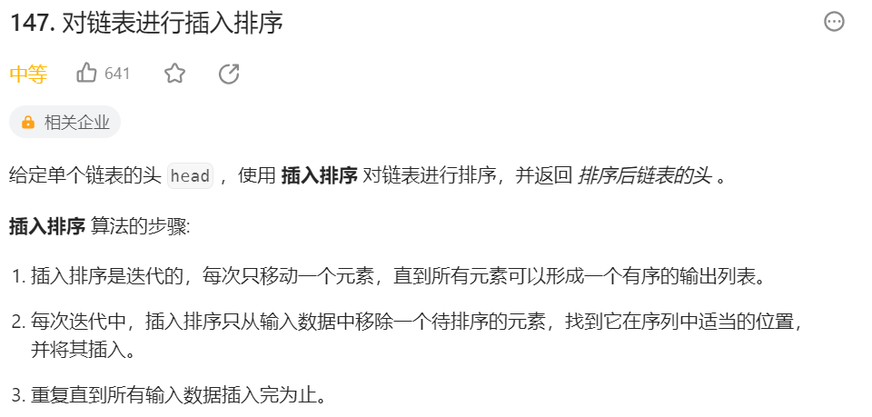
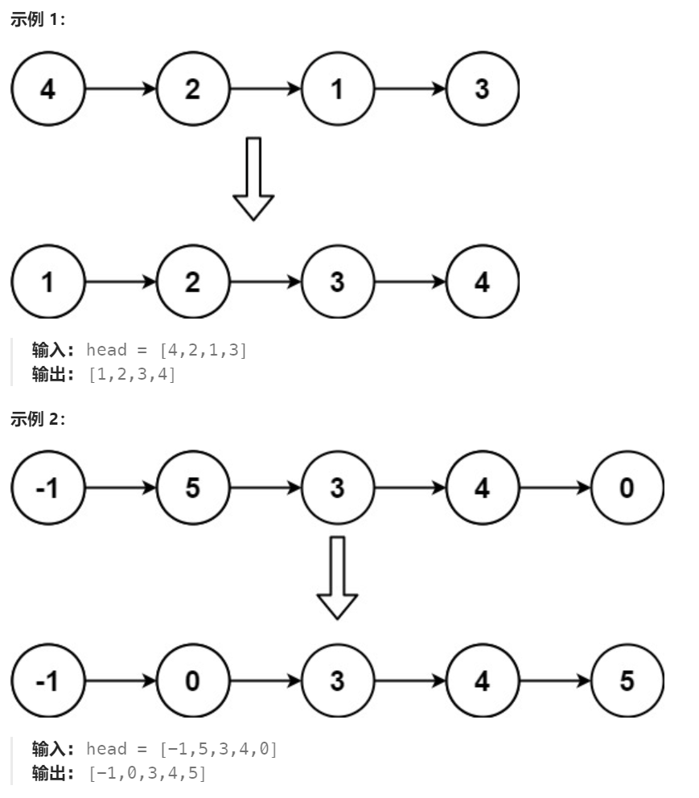

# 147 对链表进行插入排序

## 一、题目




## 二、示例




## 三、思路

从前往后遍历，根据插入排序的思想，每一遍使的前部分有序节点个数加一。

由于采用链表结构，调整节点时需要注意指针操作。且有可能涉及表头节点的变更，可以使用dummy队头空节点。


## 四、代码

```python
# Definition for singly-linked list.
# class ListNode:
#     def __init__(self, val=0, next=None):
#         self.val = val
#         self.next = next
class Solution:
    def insertionSortList(self, head: Optional[ListNode]) -> Optional[ListNode]:
        dummy = ListNode(0,head)
        pre,cur = head,head.next # 默认第一个节点有序，从第二个节点开始

        while cur:
            if cur.val > pre.val: # 已默认有序，不需要调整
                pre,cur = cur,cur.next
                continue
            
            # 当前cur节点不符合有序，遍历查找其在前面链表中合适的位置
            tmp = dummy
            while tmp.next.val < cur.val: # 找到第一个值大于cur的节点（此时tmp指向其前一节点）
                tmp = tmp.next
            # 将cur节点插入到前面链表中
            pre.next = cur.next
            cur.next = tmp.next
            tmp.next = cur
            cur = pre.next
        
        return dummy.next
```


## 五、提交

