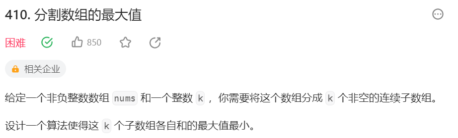

# 410 分割数组的最大值

## 一、题目




## 二、示例


## 三、思路

先不管题目要求分为几组，我们可以发现，各组和的最大值一定是在一个区间内取到的。这个区间最小值就是数组中最大的那个数（考虑每个分组中数的个数为1时），区间最大值就是数组中所有数的总和（考虑只划分为一个分组的情况）。

确定目标值所在区间后，我们明白这个目标结果一定是在这个区间内的，且根据题目可知是个整数，那有什么办法准确定位到这个数呢？

暴力解可以遍历区间上的每一个数，判断在目标值一定的条件下，是否能将原数组分为指定m个子数组。但这样时间复杂度会很高，考虑到我们知道了结果所在的一个单调连续的区间上，可以使用二分查找的思路。

二分查找主要是在完全穷举遍历的基础上，利用连续数字的大小关系大面积排除一些情况。那么题目中有哪些数值之前存在某些关系？以【1，7，2，5，8】要求分为m=3组为例，目标值区间为【8，23】，我们先取中点15，进行某种判断得到【1，7，2，5 | 8】这样一种划分，但只能分成2组不合要求。显然是我们目标值取大了，如果再取【15，23】中的某个目标值，那么就只能划分出一个数组都不合要求，这样答案区间就可以被我们缩小。

在进一步之前，需要提醒的是上述区间内并不是每个值都是可以取到的，当我们缩小答案区间为【8，14】，取子数组和最大值取为11，会发现无法划分出一个和为11的子数组。那么我们将如何确定11是取大了还是取小了呢？

考虑到问题的复杂性，我们将换一种思路来设计用于判断中间取值的函数。**当我们取子数组和最大值为11时，我们并不要求找到一个同时满足划分组数等于3且子数组最大和为11的方案。而是转为考虑在子数组和最大值未达到11的情况下，在每个子数组尽量长的情况下，能将原数组划分为几个子数组。**

这里针对【1，7，2，5，8】要求分为m=3组这个例子，我们重新梳理一遍流程。

1、首先知道目标值一定在【8，23】之间，于是想到先确定中点15是否满足要求。

2、取目标值15，在子数组和最大值未达到15的情况下，每个子数组尽量长的划分结果是【1，7，2 | 5，8】，子数组个数小于3。我们需要划分更多的分组，显然子数组和的最大值应该比15更小，必然在【8，14】上取到。

3、取目标值11，在子数组和最大值未达到11的情况下，每个子数组尽量长的划分结果是【1，7，2 | 5，8】，同上，子数组和的最大值应该比11更小，必然在【8，10】上取到。

4、取目标值9，在子数组和最大值未达到9的情况下，每个子数组尽量长的划分结果是【1，7 | 2，5 | 8】，此时子数组个数为3符合要求，可以确定子数组和最大值不超过9，进一步缩短区间发现答案仅剩8即为我们要找的结果，也就是这个算法终止的条件。

这里有两个疑点需要再举例解释一下。

第一个是，对于取值的判断函数，如果其中划分出的子数组个数正好等于要求的个数时，如何判断该值是大是小及区间走向？同样取【1，7，2，5，8】这个数组，但要求划分为m=2组。第一步区间是相同的，我们取15来进行判断，此时划分结果同样是【1，7，2 | 5，8】，但子数组个数符合要求。**但注意我们的目标是找到符合m=2条件下子数组和最大值最小的数，当前我们只是可以确定在m=2的条件下这个最大值未达到15，为找到最小值我们应该选择左区间进一步判断。**

第二个是，为什么要使划分的每个数组和尽量大？这里用到贪心算法的思想，只有在每个子数组都尽量长的条件下，也就是划分出的子数组个数尽量少的条件下，当子数组和最大值取值导致出现的子数组数量依然大于要求数时，才能说明我们的取值偏小，应当在右侧区间继续寻找。

## 四、代码

```python
class Solution:
    def splitArray(self, nums: List[int], k: int) -> int:
        l,r = max(nums),sum(nums)

        def test(largest):
            subarray = 1 # 当前划分出子数组个数
            curSum = 0
            for n in nums:
                curSum += n
                if curSum > largest:
                    subarray += 1
                    curSum = n
            return subarray <= k

        while l <= r:
            mid = l + (r - l) // 2
            if test(mid):
                r = mid - 1
            else:
                l = mid + 1

        return l


```


## 五、提交

