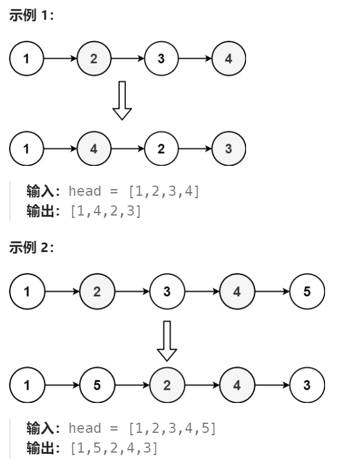
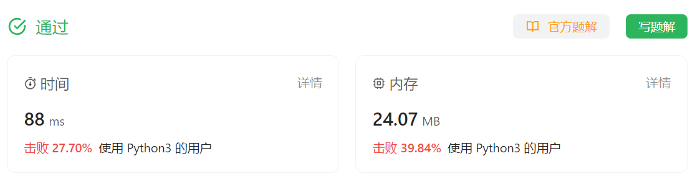

# 143 重排链表

## 一、题目


## 二、示例




## 三、思路

根据题目描述及观察可知，需要将一串数字划分为两个部分（前、后），并将顺序前部分和逆序后部分交叉组成新的一串数。

**问题1：如何划分两部分数？**

观察可知无论总数是奇数还是偶数，总是前一部分数 大于等于 后一部分数。

可以使用快慢指针的方法进行分割。当快指针到头时，慢指针总是在前一部分的最后一个数上。

**问题2：如何让后一部分数逆序排列？**

由于数据结构为单链表，查找方向为单向，所以需要让后一部分单链表逆序排列，可以在找到后一部分第一个数后，通过循环遍历进行逆序排列。

**问题3：如何组合出新链表？**

通过前两步，可以得到前、后两个部分单链表的第一个节点，通过循环遍历的方式进行链表融合。


### 四、代码

```python
# Definition for singly-linked list.
# class ListNode:
#     def __init__(self, val=0, next=None):
#         self.val = val
#         self.next = next
class Solution:
    def reorderList(self, head: Optional[ListNode]) -> None:
        """
        Do not return anything, modify head in-place instead.
        """
        # 划分前后两部分
        slow,fast = head,head.next
        p1,p2 = head,None

        while fast and fast.next:
            slow = slow.next
            fast = fast.next.next

        p2 = slow.next # 将后一部分第一个节点给p2
        slow.next = None # 将前一部分与后一部分分割开

        # 将后一部分链表逆序排列
        pre = None
        curr = p2
        while curr:
            tmp = curr.next
            curr.next = pre
            pre = curr
            curr = tmp
        p2 = pre # 将逆序后链表的第一个节点交给p2保存

        # 融合两个链表 
        curr1 = p1
        curr2 = p2

        while curr2:
            tmp1,tmp2 = curr1.next,curr2.next
            curr1.next = curr2
            curr2.next = tmp1
            curr1,curr2 = tmp1,tmp2


        
```


### 五、提交


