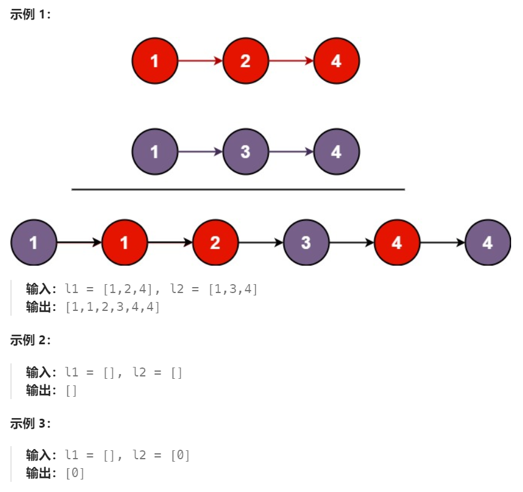

# 21 合并两个有序链表

## 一、题目


## 二、示例




## 三、思路

从两个链表首节点开始遍历，比较对应节点元素大小，取小的作为新链表节点。

当某条链表率先遍历完毕后，将另一条链表剩下部分接入新链表末尾即可。


## 四、代码

```python
# Definition for singly-linked list.
# class ListNode:
#     def __init__(self, val=0, next=None):
#         self.val = val
#         self.next = next
class Solution:
    def mergeTwoLists(self, list1: Optional[ListNode], list2: Optional[ListNode]) -> Optional[ListNode]:
        l1,l2 = list1,list2
        dummy = ListNode()
        curr = dummy

        while l1 and l2:
            if l1.val <= l2.val:
                curr.next = l1
                l1 = l1.next
            else:
                curr.next = l2
                l2 = l2.next
            curr = curr.next
        
        if not l1:
            curr.next = l2
        
        if not l2:
            curr.next = l1
        
        return dummy.next
```


## 五、提交

