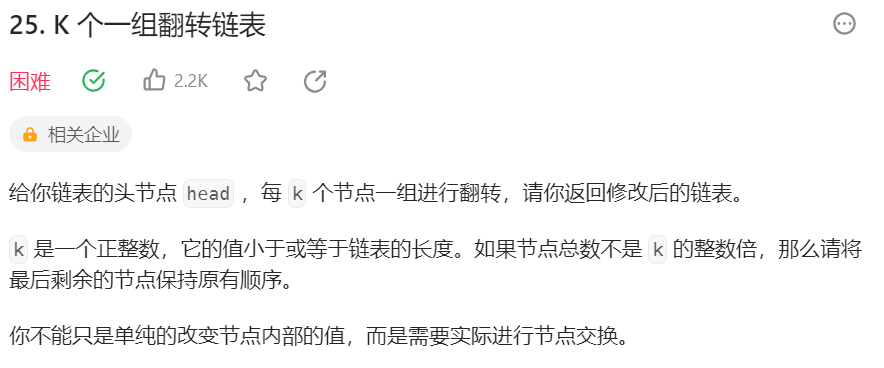
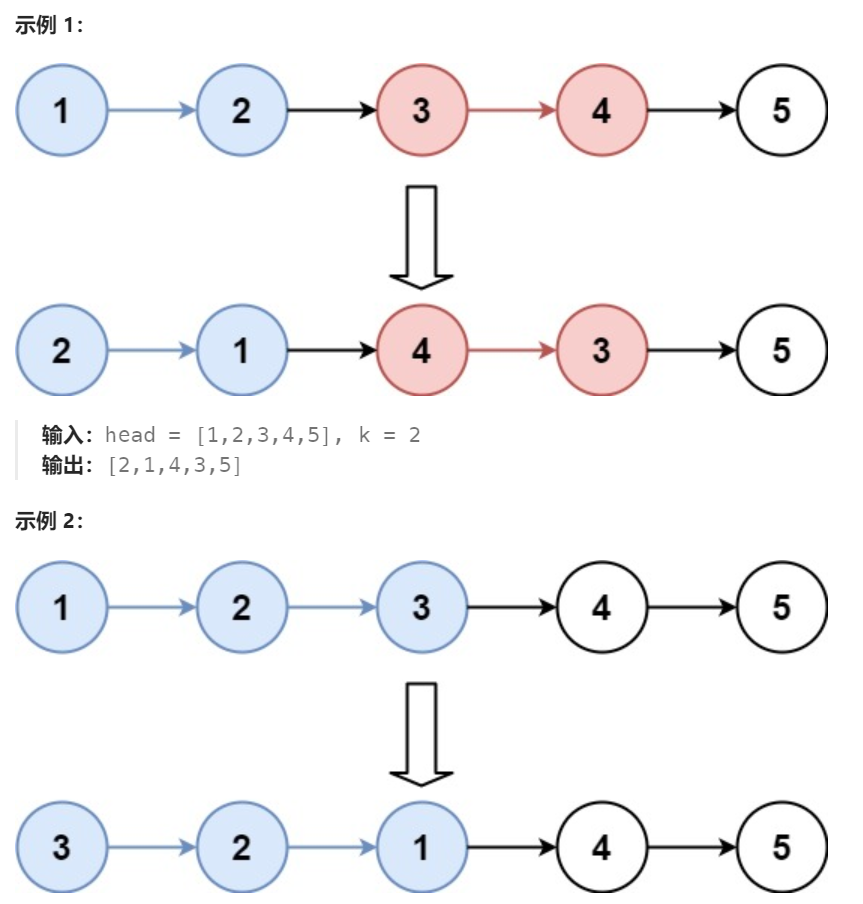

# 25 K个一组翻转链表

## 一、题目




## 二、示例




## 三、思路

从链表头开始遍历整个链表，依次按组进行翻转。

先确定每组的起始节点及结束节点，在翻转前保存下一组起始节点。并且由于每组节点翻转后起始节点会改变，所以需要保存当前组起始前一节点。

翻转当前组，原组起始节点将作为新组最后一个节点，且与下一组起始节点相连。

当前组翻转后第一个节点发生变化，则需要更新当前组原起始前一节点指向。

最后更新组相关指针，下一组翻转操作需要指针包括：组起始前节点，组起始节点，组结束节点，下一组起始节点


## 四、代码

```python
# Definition for singly-linked list.
# class ListNode:
#     def __init__(self, val=0, next=None):
#         self.val = val
#         self.next = next
class Solution:
    def reverseKGroup(self, head: Optional[ListNode], k: int) -> Optional[ListNode]:
        dummy = ListNode(0,head)
        prevGroup = dummy

        while True: # 可能进行多组翻转操作
            # 在翻转当前组之前，保存当前组及下一组节点
            thisGroupFirst = prevGroup.next
            thisGroupLast = self.findGroupLast(prevGroup,k)
            # 如果后面一组没凑齐K个，结束翻转
            if not thisGroupLast:
                break;
            nextGroupFirst = thisGroupLast.next

            # 翻转当前组
            prev,curr = nextGroupFirst,thisGroupFirst
            while curr != nextGroupFirst:
                nxt = curr.next
                curr.next = prev
                prev = curr
                curr = nxt

            # 更新group相关指针
            prevGroup.next = thisGroupLast # 当前组头节点变更，组前节点指向需更新
            prevGroup = thisGroupFirst #当前组结束操作，记录下一组的组前节点
        return dummy.next
            
    def findGroupLast(self,curr,k):
        while curr and k > 0:
            curr = curr.next
            k -= 1
        return curr

```


## 五、提交

