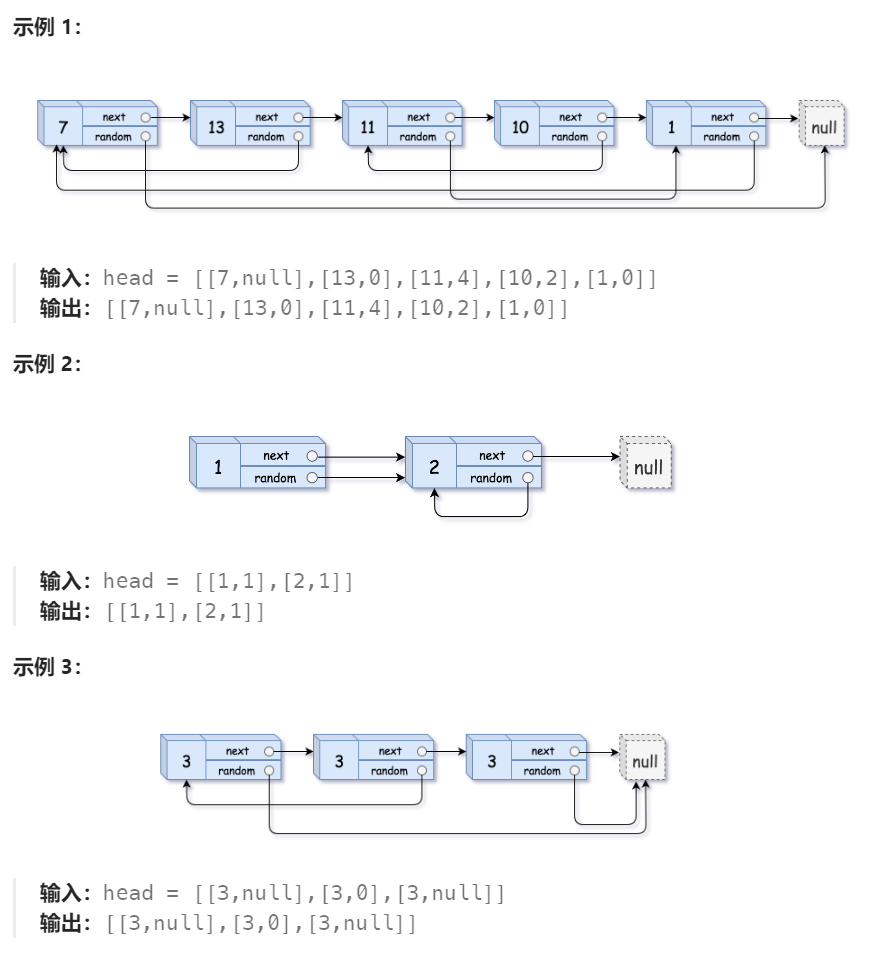

# 138 随机链表的复制

## 一、题目


## 二、示例




## 三、思路

链表中各节点除记录next节点指向外，包含一个随机节点指向。因此在一次循环克隆中，可能出现随机指向节点未创建的情况，所以至少需要循环两边完成复制。

为在第二次循环中快速找到对应节点，可以在第一次循环中使用Hash Map进行存储。


## 四、代码

```python
"""
# Definition for a Node.
class Node:
    def __init__(self, x: int, next: 'Node' = None, random: 'Node' = None):
        self.val = int(x)
        self.next = next
        self.random = random
"""

class Solution:
    def copyRandomList(self, head: 'Optional[Node]') -> 'Optional[Node]':
        if not head:
            return None
            
        copyMap = {}
        
        # 第一次循环，克隆节点并保存
        curr = head
        while curr:
            copyMap[curr] = Node(curr.val)
            curr = curr.next

        # 第二次循环，绑定克隆节点指针指向
        curr = head
        while curr:
            copy = copyMap[curr]
            copy.next = copyMap[curr.next] if curr.next else None
            copy.random = copyMap[curr.random] if curr.random else None
            curr = curr.next
        
        return copyMap[head]
```


## 五、提交

