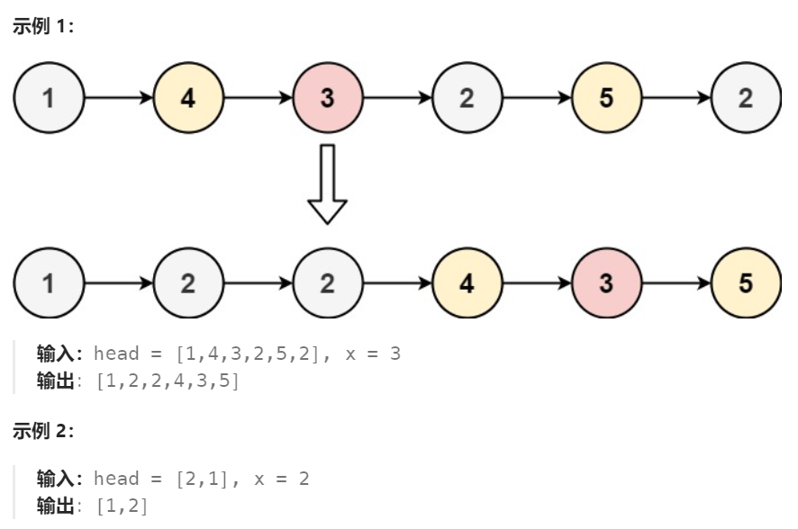

# 86 分隔链表

## 一、题目


## 二、示例




## 三、思路

预备left、right两个链表，遍历原链表，小于x的节点放在左链表中，大于等于x的节点放在右链表中，最后链接左右两链表（修改尾部指针）


## 四、代码

```python
# Definition for singly-linked list.
# class ListNode:
#     def __init__(self, val=0, next=None):
#         self.val = val
#         self.next = next
class Solution:
    def partition(self, head: Optional[ListNode], x: int) -> Optional[ListNode]:
        leftDummy, rightDummy = ListNode(),ListNode()
        leftTail,rightTail = leftDummy,rightDummy
        curr = head
        
        while curr:
            if curr.val < x:
                leftTail.next = curr
                leftTail = leftTail.next
            else:
                rightTail.next = curr
                rightTail = rightTail.next
            curr = curr.next

        leftTail.next = rightDummy.next
        rightTail.next = None

        return leftDummy.next

```


## 五、提交

