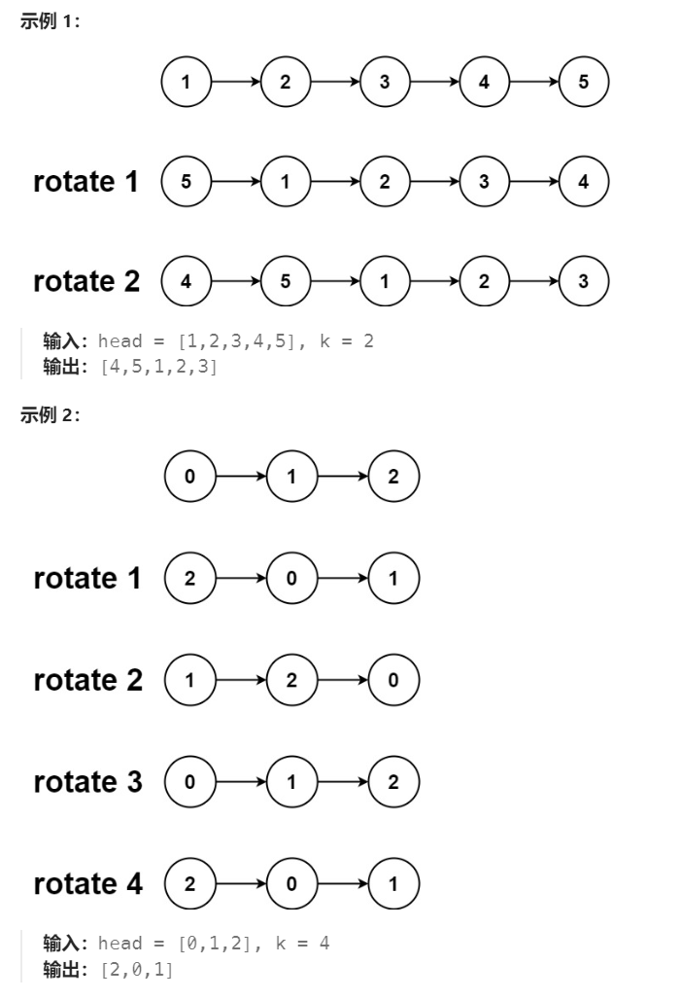

# 61 旋转链表

## 一、题目


## 二、示例




## 三、思路

由示例可以看出相当于将链表划分为左右两部分，然后将左右两部分交换顺序。

例如当链表为1，2，3，4，5，k=2时，在3，4间切开并交换两部分，类似与找到倒数第k个节点。

但不同点在于这里的k可以大于链表长度，因为当k=length时整个链表完成了一遍循环，结果与原链表相同。因此这里需要先确定链表长度，对k取模后才能确定一个能用于计算指针偏移的k值。

根据k与指针偏移之间的数学关系（观察归纳可知），找到左边链表的尾节点，通过修改指针指向切断链表并重组。


## 四、代码

```python
# Definition for singly-linked list.
# class ListNode:
#     def __init__(self, val=0, next=None):
#         self.val = val
#         self.next = next
class Solution:
    def rotateRight(self, head: Optional[ListNode], k: int) -> Optional[ListNode]:
        if not head or not head.next:
            return head

        length,tail = 1, head
        while tail.next:
            length += 1
            tail = tail.next

        # 当k=length时结果与原来相同，需要先确定length
        k = k % length
        if k == 0:
            return head

        curr = head
        for i in range(0,length - k - 1):
            curr = curr.next
        # 找到左边最后一个节点
        rightHead = curr.next
        curr.next = None
        tail.next = head

        return rightHead
```


## 五、提交

