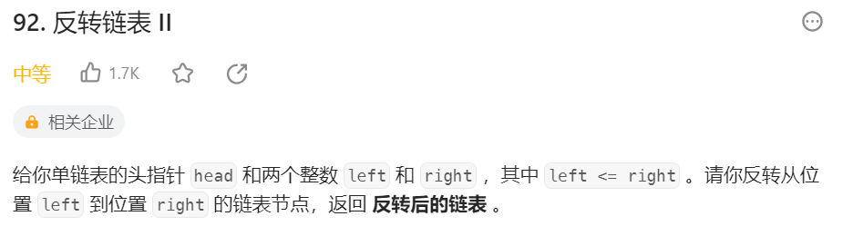
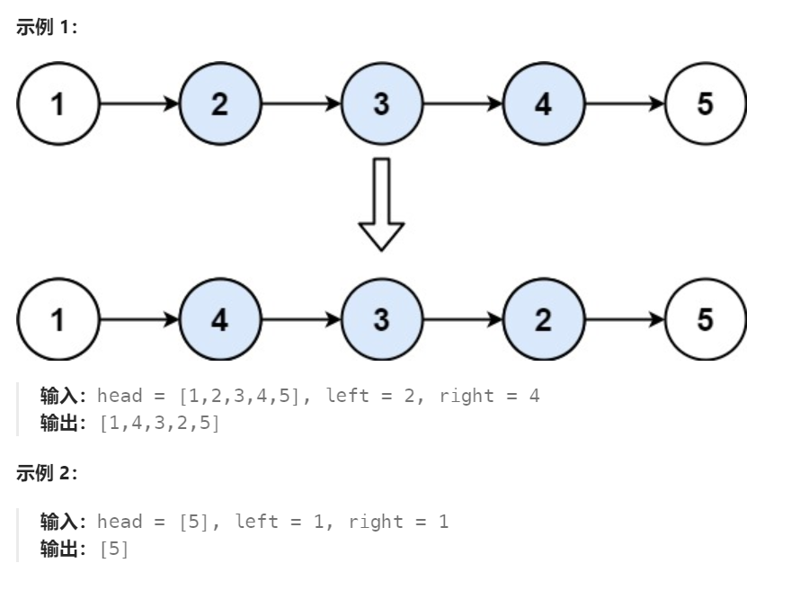

# 92 反转链表Ⅱ

## 一、题目




## 二、示例




## 三、思路

首先确定起始节点所在位置，保留起始节点前一节点。

从起始节点开始遍历指定个数节点，将节点下一指针向前反转，直到结束节点。

调整头尾指针使反转部分与原链表相连。


## 四、代码

```python
# Definition for singly-linked list.
# class ListNode:
#     def __init__(self, val=0, next=None):
#         self.val = val
#         self.next = next
class Solution:
    def reverseBetween(self, head: Optional[ListNode], left: int, right: int) -> Optional[ListNode]:
        dummy = ListNode(0,head)
        leftPre,curr = dummy,head

        # 找到要反转的起始节点，并保存它前一节点
        for i in range(left - 1):
            leftPre = curr
            curr = curr.next

        # 从起始节点开始反转right - left + 1个节点
        pre = None
        for i in range(right - left + 1):
            tmp = curr.next
            curr.next = pre
            pre = curr
            curr = tmp
        
        # 将反转部分与原链表相连
        leftPre.next.next = curr
        leftPre.next = pre

        return dummy.next
        
```


## 五、提交


