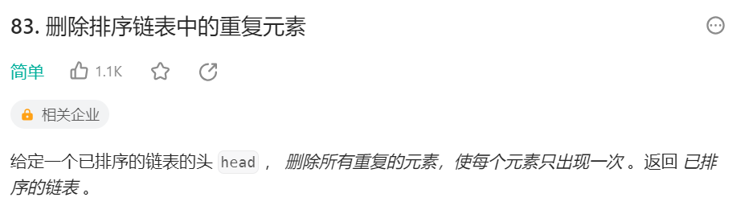
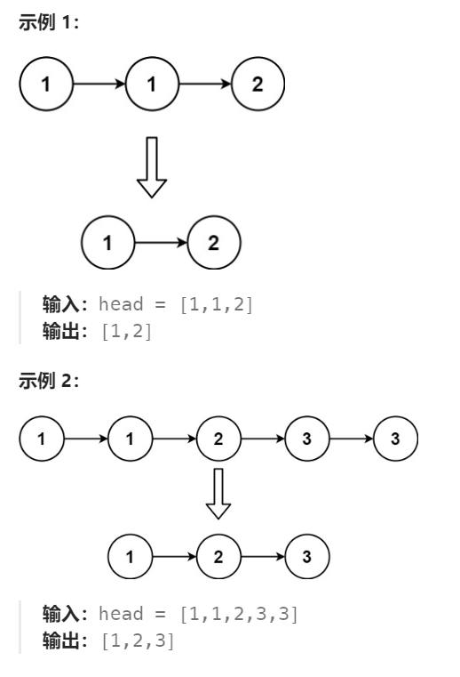
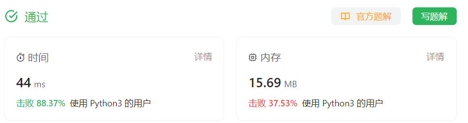

# 83 删除排序链表中的重复元素

## 一、题目




## 二、示例




## 三、思路

由于链表有序，所以重复的节点是相邻的，从头遍历链表，比较当前节点的next与当前节点的值是否重复。若重复，直接指向再下一个节点；若不重复，则可进行下一节点遍历。


## 四、代码

```python
# Definition for singly-linked list.
# class ListNode:
#     def __init__(self, val=0, next=None):
#         self.val = val
#         self.next = next
class Solution:
    def deleteDuplicates(self, head: Optional[ListNode]) -> Optional[ListNode]:
        curr = head

        while curr and curr.next:
            if curr.next.val == curr.val:
                curr.next = curr.next.next
            else:
                curr = curr.next

        return head
```


## 五、提交

