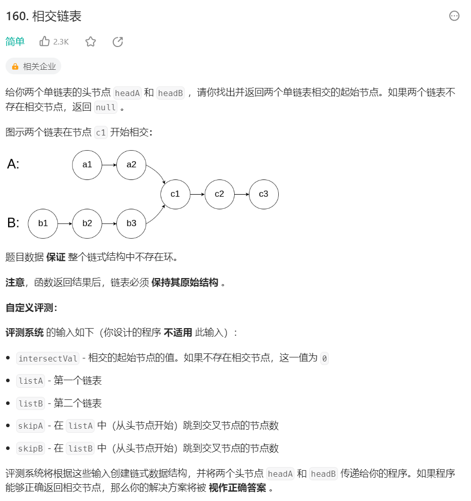
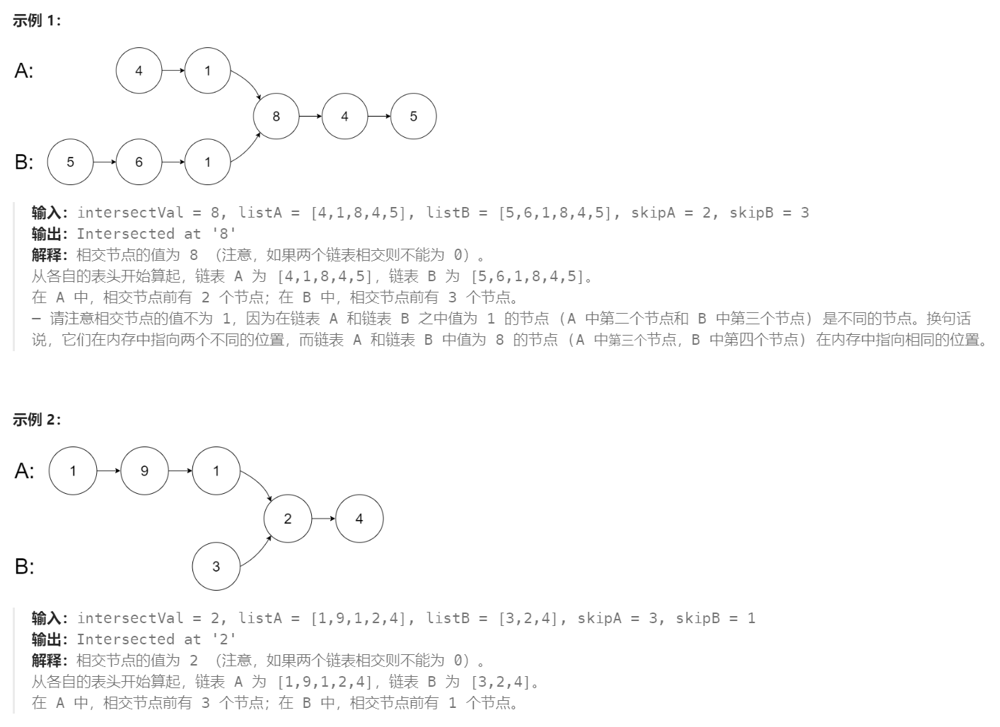

# 160 相交链表

## 一、题目




## 二、示例




## 三、思路

以示例1为例，从A链表开始遍历经过5个节点（长度m=5），从B链表开始遍历经过6个节点（长度n=6）。

若指针1：先遍历A链表，再遍历B链表，到达最后一个节点经过11个节点；

若指针2：先遍历B链表，再遍历A链表，同样经过11个节点到达最后一个节点。

推理可知，当指针1和指针2同样经过m+n个节点后，必然会在最后节点相遇（可视Null为同一节点）。向前推理可知若两链表不是在最后节点第一次相遇，那么在第一次相遇的节点同样满足指针1和指针2经过节点长度相同。


## 四、代码

```python
# Definition for singly-linked list.
# class ListNode:
#     def __init__(self, x):
#         self.val = x
#         self.next = None

class Solution:
    def getIntersectionNode(self, headA: ListNode, headB: ListNode) -> Optional[ListNode]:
        l1,l2 = headA,headB

        while l1 != l2:
            l1 = l1.next if l1 else headB
            l2 = l2.next if l2 else headA

        return l1 
```


## 五、提交

