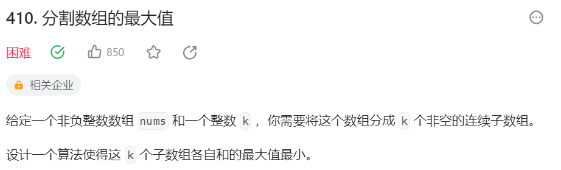
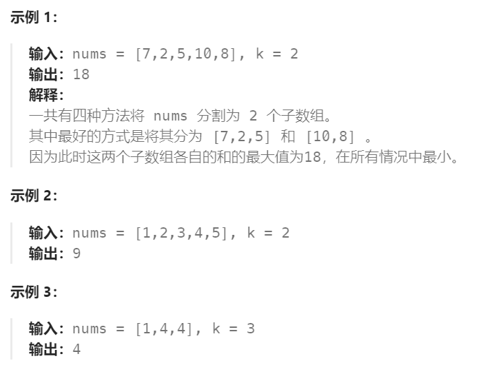
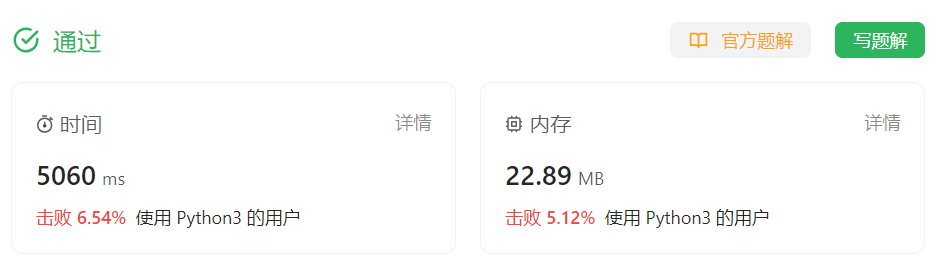

# 410 分割数组的最大值

## 一、题目




## 二、示例




## 三、思路

暴力穷举思路：长度为5的数【7，2，5，10，8】，要划分为三个子数组。

考虑第一个子数组长度可取范围【7，2，5】。（由于后面每个数组至少有一位，需要保留数组末尾两位）

当第一个数字取【7】时，则需要考虑在【2，5，10，8】中划分为两个子数组。此时第二个子数组可取范围【2，5，10】。（同理由于后面每个数组至少有一位，需要保留数组末尾一位）

| 第一段 | 第二段       | 第三段          |
| ------ | ------------ | --------------- |
| 【7】  | 【2】        | 【5，10，8】    |
| 【7】  | 【2，5】     | ***【10，8】*** |
| 【7】  | 【2，5，10】 | ***【8】***     |

同理，若第一段取【7，2】

| 第一段   | 第二段    | 第三段          |
| -------- | --------- | --------------- |
| 【7，2】 | 【5】     | ***【10，8】*** |
| 【7，2】 | 【5，10】 | ***【8】***     |

若第一段取【7，2，5】

| 第一段      | 第二段 | 第三段      |
| ----------- | ------ | ----------- |
| 【7，2，5】 | 【10】 | ***【8】*** |


观察规律我们可以将问题化简，原问题：从7开始，将数组划分为3个子数组。转换为：

情况一：将7作为第一个子数组，从2开始，将数组划分为2个子数组。

情况二：将7，2作为第一个子数组，从5开始，将数组划分为2个子数组。

情况三：将7，2，5作为第一个子数组，从10开始，将数组划分为2个子数组。

这里三种情况的情况数量，取决于原数组长度及要划分子数组个数（由于后面每个数组至少有一位，需要保留数组末尾m-1位）。

而每种情况又可以转换为，将当前【i，末尾m-1位】作为第一个数组，从i+1开始，将数组划分为m-2个子数组。

直到从某位开始划分为1个子数组，即为从该位开始后的所有数为一组。

由于各个子问题中可能出现重复现象，因此可以将各场景（从i号开始将数组划分为m个子数组）与其对应的目标数（各子数组和的最大值）绑定记录下来，减少重复迭代。


## 四、代码

```python
class Solution:
    def splitArray(self, nums: List[int], k: int) -> int:
        dp = {}

        # 从第i个数字开始划分，划分为m组,返回子数组各自和的最小值
        def split(i,m): 
            if m == 1: # 从第i个数开始划分为1组，即从i开始后的所有数一组
                return sum(nums[i:]) 
            if (i,m) in dp: # dp缓存中已记录
                return dp[(i,m)]

            res,curSum = float("inf"),0 # 初始各数组和最大值为无穷

            # j表示第一个数组末尾下标。每个数组最少有1个数，故第一个数组长度有限
            for j in range(i,len(nums) - m + 1): 
                curSum += nums[j] # curSum记录第一段数组递增的总和
                maxSum = max(curSum,split(j + 1, m - 1)) # 除去第一段数组，从j + 1号数字开始划分为m-1组的目标值
                res = min(res,maxSum) # 判断当前从j开始划分为m组的目标值是否是全局最小的

                # 提前退出条件：当前划分出的第一段数组的和已经大于全局最小值
                if curSum > res:
                    break

            # 记录从第i个数字开始划分，划分为m组时，子数组各自和的最小值并返回
            dp[(i,m)] = res
            return res
        
        return split(0,k)

```


## 五、提交

