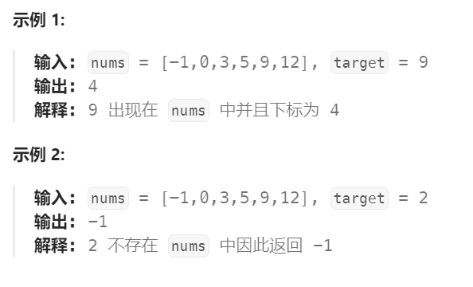

# 704 二分查找

## 一、题目


## 二、示例




## 三、思路

单调有序区间上查找一个元素，非常适合且已指明使用二分的方法。

以示例1为例，我们要找9这个元素，其实就是要把整个数组分为两个部分，可以设前面一部分都小于9，后面一部分大于等于9，我们只要找到这个分界处即可确定第二部分中第一个数就是我们想找的。


## 四、代码

```python
class Solution:
    def search(self, nums: List[int], target: int) -> int:
        l,r = 0,len(nums) - 1

        while l < r:
            mid = l + (r - l) // 2
            if nums[mid] < target: # 选择让l左侧（包括l）的部分都小于target
                l = mid + 1        # 因此l需要往后移动+1
            else:              # 而r右侧（包括r）是大于等于target的部分
                r = mid        # 因此大于等于时r指向mid处即可
        
        return r if nums[r] == target else -1
```


## 五、提交

