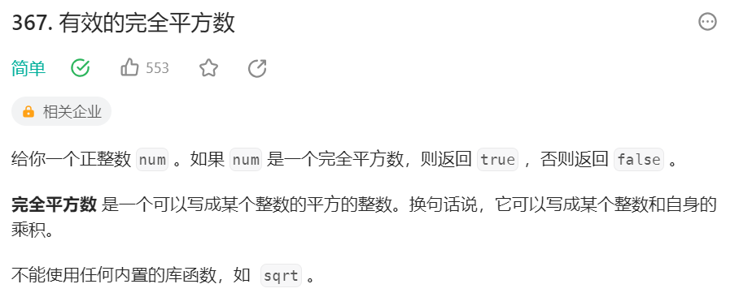
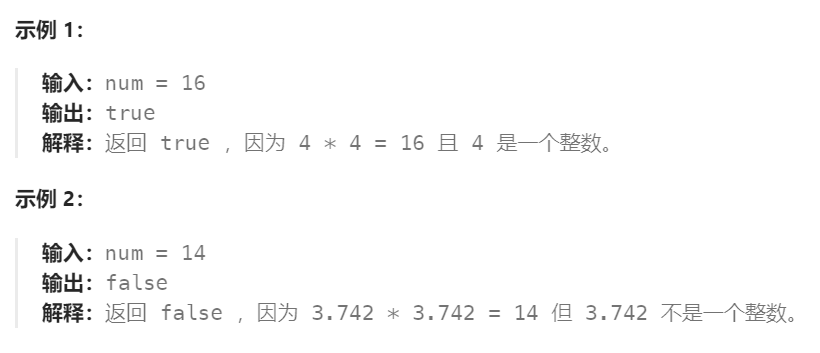

# 367 有效的完全平方数

## 一、题目




## 二、示例




## 三、思路

显然一个完全平分数n开根号的到的数一定在1到n之间，使用二分查找的方法可以帮助我们快速排除掉不合适的值。

在具体操作上，我们可以将【1，n】这个区间划分成两个部分【1，k】和【k+1，n】，其中k^2 < n而(k+1)^2 >= n，这样我们可以确定如果n真的是一个完全平分数的话，那么k+1一定是其开根号的结果。

或者我们反过来让k^2 <= n而(k+1)^2 > n也可以，这样我们取左边最后的k即可。


## 四、代码

```python
class Solution:
    def isPerfectSquare(self, num: int) -> bool:
        l,r = 1, num

        while l + 1 < r :
            mid = l + (r - l) // 2
            if mid * mid <= num:
                l = mid
            else:
                r = mid
        
        return l*l == num
```


## 五、提交

