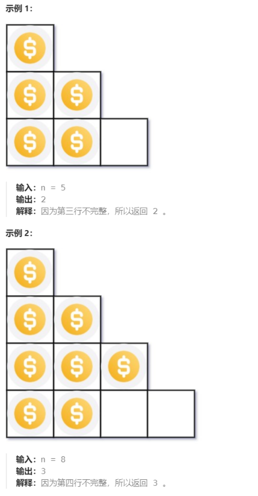

# 441 排列硬币

## 一、题目


## 二、示例




## 三、思路

给定数n，要求判断是否能由1+2+3+...+k 表示，即(k + 1)*k/2 = n，要求判断对于给定数n，能否找到整数k满足该式子。显然k只能在区间【1，n)上，且k与n的取值是正相关的，可以使用二分方法快速排除。


## 四、代码

```python
class Solution:
    def arrangeCoins(self, n: int) -> int:
        l,r = 1, n

        while l + 1 < r:
            mid = l + (r - l) // 2
            s = (mid + 1) * mid / 2

            if s <= n:
                l = mid
            else :
                r = mid
        
        return l
```


## 五、提交

