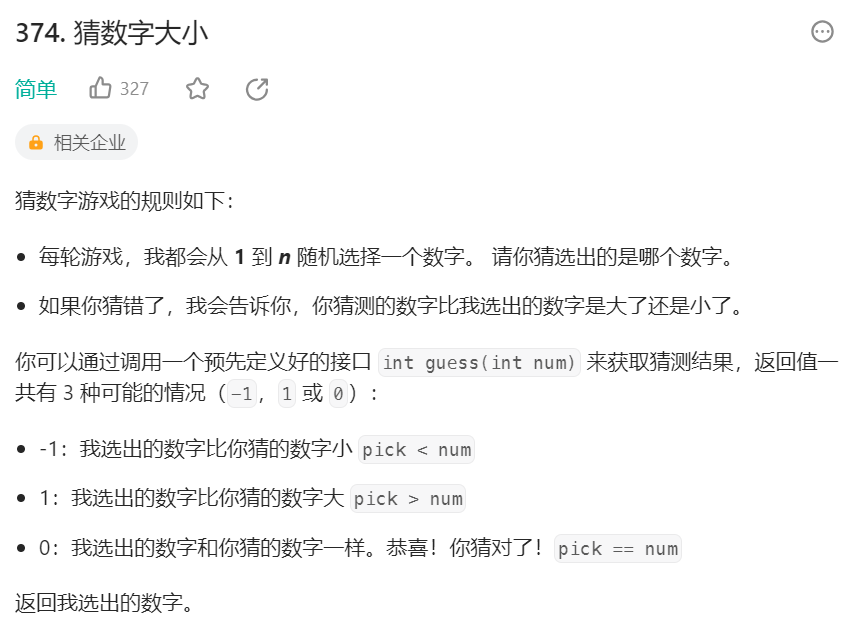
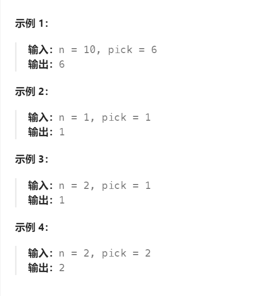
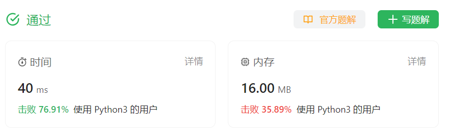

# 374 猜数字大小

## 一、题目




## 二、示例




## 三、思路

基本二分查找


## 四、代码

```python
# The guess API is already defined for you.
# @param num, your guess
# @return -1 if num is higher than the picked number
#          1 if num is lower than the picked number
#          otherwise return 0
# def guess(num: int) -> int:

class Solution:
    def guessNumber(self, n: int) -> int:
        l,r = 1,n

        while l <= r:
            mid = l + (r - l) // 2
            if guess(mid) == -1:
                r = mid - 1
            elif guess(mid) == 1:
                l = mid + 1
            else:
                return mid

```


## 五、提交

